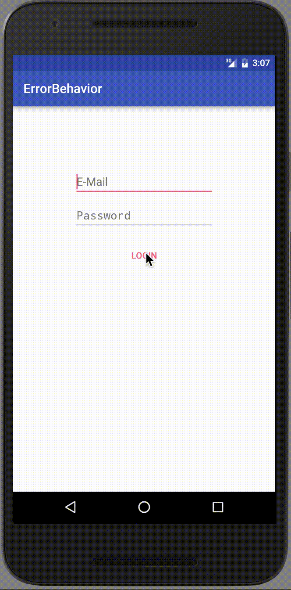

# ErrorBehavior
## What is it?
This is a custom [CoordinatorLayout.Behavior](https://android.googlesource.com/platform/frameworks/support/+/master/design/src/android/support/design/widget/CoordinatorLayout.java#1625) which will display a error animation like OS X login.
## Screenshots

# Links that helped me a lot
* [Medium, Intercepting everything with CoordinatorLayout Behaviors](https://medium.com/google-developers/intercepting-everything-with-coordinatorlayout-behaviors-8c6adc140c26)
* [SwipeDismissBehavior](https://android.googlesource.com/platform/frameworks/support/+/master/design/src/android/support/design/widget/SwipeDismissBehavior.java)